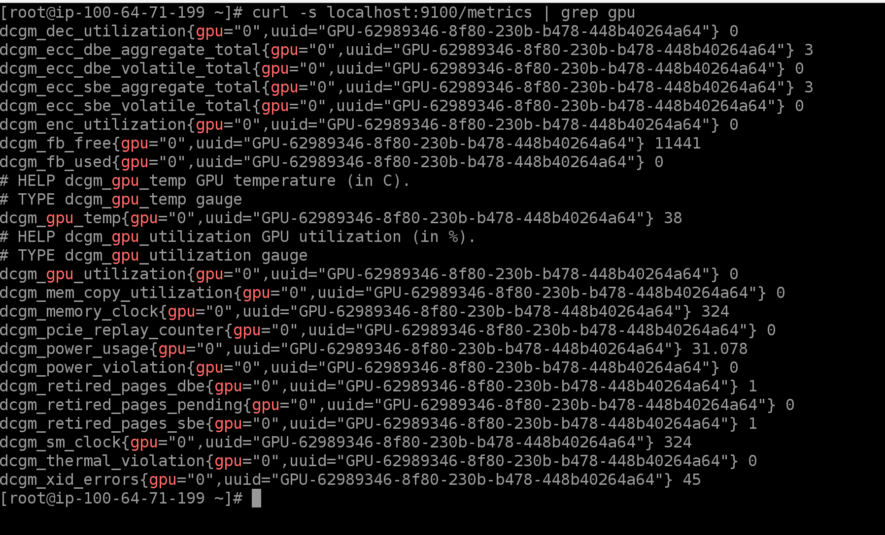

# amazon-eks-gpu-scale

This repo walks you through the NVIDIA GPU autoscaling with HPA on custom GPU metrics as well as CA(cluster autoscaler) on Amazon EKS.

# Prerequisities
Amazon EKS cluster with GPU nodes(P2 or P3)


# Label your GPU nodes

```bash
$ kubectl label nodes {NODE_NAME} hardware-type=NVIDIAGPU
# list all GPU nodes. In this sample we only have 1 onde
$ kubectl get no -l hardware-type=NVIDIAGPU
NAME                                               STATUS   ROLES    AGE    VERSION
ip-100-64-71-199.ap-northeast-1.compute.internal   Ready    <none>   111m   v1.13.7-eks-c57ff8
```


# Install the Nvidia device plugin

```
$ kubectl apply -f https://raw.githubusercontent.com/NVIDIA/k8s-device-plugin/1.0.0-beta/nvidia-device-plugin.yml
```

# Install Helm

follow [this guide](https://github.com/pahud/amazon-eks-workshop/blob/master/00-getting-started/installing-helm.md) to install Helm.

# Install Prometheus and GPU Node Exporter

follow [this guide](https://nvidia.github.io/gpu-monitoring-tools/) to install `prometheus-operator`, `kube-prometheus` and `GPU metrics dashboard`.


SSH into the GPU node validate the `dcgm_*` metrics.



# Install the Prometheus Adapter to generic custom metrics

```bash
$ helm install --name prometheus-adapter --set rbac.create=true,prometheus.url=http://kube-prometheus-prometheus.monitoring.svc.cluster.local,prometheus.port=9090 stable/prometheus-adapter
```

Wait a few seconds and you should be able to get custom metrics from the API

```bash
$ kubectl get --raw /apis/custom.metrics.k8s.io/v1beta1 | jq -r . | grep dcgm_gpu_utilization
      "name": "jobs.batch/dcgm_gpu_utilization",
      "name": "services/dcgm_gpu_utilization",
      "name": "namespaces/dcgm_gpu_utilization",
      "name": "pods/dcgm_gpu_utilization",
```

And check the metrics value like this

```bash
$ kubectl get --raw "/apis/custom.metrics.k8s.io/v1beta1/namespaces/default/services/kube-prometheus-exporter-node/dcgm_gpu_utilization" | jq -r .
{
  "kind": "MetricValueList",
  "apiVersion": "custom.metrics.k8s.io/v1beta1",
  "metadata": {
    "selfLink": "/apis/custom.metrics.k8s.io/v1beta1/namespaces/default/services/kube-prometheus-exporter-node/dcgm_gpu_utilization"
  },
  "items": [
    {
      "describedObject": {
        "kind": "Service",
        "namespace": "default",
        "name": "kube-prometheus-exporter-node",
        "apiVersion": "/v1"
      },
      "metricName": "dcgm_gpu_utilization",
      "timestamp": "2019-07-07T04:57:36Z",
      "value": "0"
    }
  ]
}
```

## deploy the GPU stress testing application

```bash
$ kubectl apply -f gputest.yaml 
deployment.extensions/gputest configured
# view the deployment
$ kubectl get deploy/gputest
NAME      READY   UP-TO-DATE   AVAILABLE   AGE
gputest   1/1     1            1           1m
# list the pods
$ kubectl get po -l run=gputest
NAME                       READY   STATUS    RESTARTS   AGE
gputest-79988456cb-hn4h6   1/1     Running   0          1m
```

We should only have a single pod running

# Manual scale out the deployment to 2

```bash
$ kubectl scale --replicas=2 deploy/gputest                                                                                                             
deployment.extensions/gputest scaled
pahud:~/environment/k8s-gpu-hpa $ kubectl get po -l run=gputest
NAME                       READY   STATUS    RESTARTS   AGE
gputest-79988456cb-7xfpb   0/1     Pending   0          4s
gputest-79988456cb-hn4h6   1/1     Running   0          9m11s
```

The 2nd pod can't be deployed because each pod will request `1 single GPU` and we only have 1 node in the cluster.

```
Events:
  Type     Reason            Age                From               Message
  ----     ------            ----               ----               -------
  Warning  FailedScheduling  43s (x2 over 43s)  default-scheduler  0/1 nodes are available: 1 Insufficient nvidia.com/gpu.
pahud:~/environment/k8s-gpu-hpa $ 
```

Let's scale it back to 1 at this moment.

```bash
$ kubectl scale --replicas=1 deploy/gputest
```


## Deploy the HPA object

Now let's deploy a `HPA` object to scale out the pods based on the `dcgm_gpu_utilization` custom metric.

```bsah
$ kubectl apply -f hpa.yaml 
horizontalpodautoscaler.autoscaling/hpa-gpu created
```

Get the HPA status. The custom metric goes to `100` now and HPA scales out to `2` as the desired replicas of this deployment.

```bash
# get the HPA
$ kubectl get hpa/hpa-gpu
NAME      REFERENCE            TARGETS   MINPODS   MAXPODS   REPLICAS   AGE
hpa-gpu   Deployment/gputest   100/80    1         3         2          62s
```

describe the HPA

```bash
$ kubectl describe hpa/hpa-gpu
Name:                                                               hpa-gpu
Namespace:                                                          default
Labels:                                                             <none>
Annotations:                                                        kubectl.kubernetes.io/last-applied-configuration:
                                                                      {"apiVersion":"autoscaling/v2beta1","kind":"HorizontalPodAutoscaler","metadata":{"annotations":{},"name":"hpa-gpu","namespace":"default"},...
CreationTimestamp:                                                  Sun, 07 Jul 2019 05:22:56 +0000
Reference:                                                          Deployment/gputest
Metrics:                                                            ( current / target )
  "dcgm_gpu_utilization" on Service/kube-prometheus-exporter-node:  100 / 80
Min replicas:                                                       1
Max replicas:                                                       3
Deployment pods:                                                    2 current / 2 desired
Conditions:
  Type            Status  Reason              Message
  ----            ------  ------              -------
  AbleToScale     True    ReadyForNewScale    recommended size matches current size
  ScalingActive   True    ValidMetricFound    the HPA was able to successfully calculate a replica count from Service metric dcgm_gpu_utilization
  ScalingLimited  False   DesiredWithinRange  the desired count is within the acceptable range
Events:
  Type    Reason             Age    From                       Message
  ----    ------             ----   ----                       -------
  Normal  SuccessfulRescale  2m33s  horizontal-pod-autoscaler  New size: 2; reason: Service metric dcgm_gpu_utilization above target
```

  The HPA is trying to scale out to `2` but the 2nd replica can't be deployed because of insufficent GPU resources.


# Cluster Autoscaler

TBD


